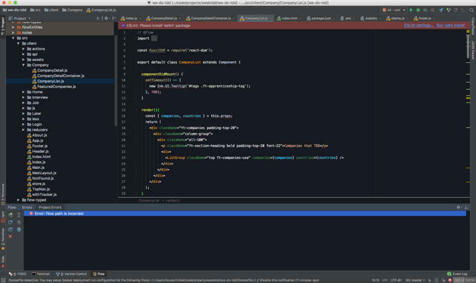

Below assumes you're using WebStorm on OS X.

Below works for IntelliJ as well.

## Shortcuts
`cmd + ,` - opens up WebStorm Preferences

## Configuring Test GUI
### Webstorm Setup - Minimal - Older versions of babel
- mocha options : `-w --require js:babel-core/register`
  - mocha is depreciating `--compilers`, just use `--require`
- insure you have installed the following: `babel-core`, `babel-preset-es2015`, `babel-register`

Above works with a `.babelrc` setup like this:

```
{
  "presets": [
    "react",
    "env"
  ],
  "plugins": [
    ["transform-object-rest-spread"],
    ["transform-runtime", {
      "polyfill": false,
      "regenerator": true
    }]
  ]
}
```
Note: The "env" preset completely replaces these now:
- These presets should be substituted with the "env" preset:
  - babel-preset-es2015
  - babel-preset-es2016
  - babel-preset-es2017
  - babel-preset-latest

### Webstorm Setup - Minimal - babel 7x
Script in package.json looks like this: `mocha --recursive -r @babel/register ./javascript/test/test.imports javascript/test/unit -w --timeout 8000`

Test Runner:
- mocha options : `-w --require @babel/register --recursive` or shortened: `-w -r @babel/register`

All this assumes you've installed the following:
`yarn add -D @babel/preset-env` - provides ES6 syntax support
`yarn add -D @babel/core @babel/cli @babel/preset-env`
`yarn add -D @babel/polyfill`  - includes a polyfill that includes a custom regenerator runtime and core-js
- I've imported the polyfill in test.imports.js and then added `src/test/test.imports.js` to the test script and also extra mocha options in the IntelliJ test runner mocha config
`yarn add -D @babel/preset-react`
`yarn add -D @babel/cli`
`yarn add -D @babel/register` - when you’re developing a Node.js application in ES6, one of the ways to run and test it is using @babel/register
`yarn add -D @babel/plugin-proposal-object-rest-spread` - while `@babel/preset-env` covers most of the ES6 support, it doesn't appear to support the ES6 object spread operator so this plugin has to still be added for now
`yarn add -D @babel/plugin-transform-runtime` - need this or you not get async support for tests and get a regeneratorRuntime babel error
`yarn add @babel/polyfill` - because React 16 depends on the collection types Map and Set
- This means you can use new built-ins like Promise or WeakMap, static methods like Array.from or Object.assign, instance methods like Array.prototype.includes, and generator functions (provided you use the regenerator plugin). The polyfill adds to the global scope as well as native prototypes like String in order to do this

Above works with a `.babelrc` setup like this:
`pollyflll` - this option for `@babel/transform-runtime` has been removed so do not add it anymore

```
{
  "presets": [
    ["@babel/preset-env", {
      "targets": {
        "node": "current"
      }
    },
    "@babel/preset-react"]
  ],
  "plugins": [
    ["@babel/plugin-proposal-object-rest-spread"],
    ["@babel/plugin-transform-runtime", {
      "polyfill": false,
      "regenerator": true
    }]
  ]
}
```

##### .babelrc
```
{
  "presets": ["es2015", "react", "stage-3"],
  "plugins": [
        ["transform-runtime", {
          "helpers": false,
          "polyfill": true,
          "regenerator": true,
          "moduleName": "babel-runtime"
        }],
        "transform-object-rest-spread"
    ]
}
```


### Test Scripts (for running tests at command-line instead of GUI)

### Color Schema
I use the Material UI free plugin to make it look awesome

I also use the atom icons plugin to improve the file and other icons even more

**Note:** If you get a green background to a selected file in the project pane, just disable file backgrounds under `Appearance & Behavior` | `File Colors`.  Disable `File colors`.

### Main Areas of WebStorm I Use
WebStorm is overwhelming at first but if you can get over yourself on that, and learn some of the main parts that most devs will need at a very basic level you'll come to find that this IDE is amazing and kicks editors like Microsoft's VS Code in the ass in terms of productivity

If you're new just focus on a few things, listed below and don't worry about trying to learn everything in WebStorm.

I don't really tweak a ton in preferences, only stuff I absolutely need to for Node, JS, and colors.  Most of the defaults I just leave as is.  That's why I don't get overwhelmed by the options in this IDE.  The defaults have been just fine for me for the most part.

I focus more on getting good at the command-line with commands, I focus on adding and finding those plugins in WebStorm preferences that help in terms of what code I work in.  So I'll spend time adding plugins that benefit me in the Plugins section of WebStorm preferences.  I also spend time adding Definitely Typed libraries to help improve the already awesome intellisense. I focus more on setting up test infrastructure, using the WebStorm test runner as opposed to running them in the console.

#### Areas I use
- fill this in later

## Performance
One of the main complaints I hear from devs is that WebStorm is slow.  That's because they don't take the time to get comfortable with WebStorm, they get impatient and jump ship to VSCode but honestly, they're missing out on a ton WebStorm can do that will blow your mind and really help you that VSCode just can't.

### It's not slow if you do the following below, at least try these:

- **disable plugins you don't need.  This is a must.**  I have no idea why WebStorm defaults to installing a shitload of stuff you might not need but they do. It'll have a huge impact on performance if you go through and uncheck plugins you don't need.  Go to **Preferences** => **Plugins** section and start unchecking boxes for those things you won't use
- You can also **increase memory allocation**

    go to **Help** => **Edit Custom VM Options** and change the following (increase their values. Max is 2048):
    - `-Xms2048m`
    - `-Xmx2048m`
- Sometimes, if you're doing something really intensive like editing a very long readme file, you might have to just **close and re-open WebStorm to clear memory**
- **if your unit tests are slow**, your **problem is not WebStorm**, your problem is **your tests**...they suck.  I'm able to run 300 tests in just a couple seconds.  IFf your tests are not well formed and just good tests, no editor or IDE is going to save you there.  So start practicing and improving and learning how to write better tests

## My WebStorm Settings
you can import and try these out if you like

- [All of my settings](webstorm-settings-all-5-17-2018.jar)
- [custom live templates (code snippets)](webstorm-settings-custom-live-templates-5-17-2018.jar) - I've created a bunch for TDD here (_code snippets I create are based on mocha, chai, and enzyme_)
- [color scheme I'm using](webstorm-settings-editor-theme-5-17-2018.jar)

    

**Live Templates** (AKA Code Snippets) location
- `user/Library/Preferences/WebStorm<version>/templates`
- this is where custom live templates you create are stored (_always back these up!!!_)
## Plugins I Use
- [js-graphql-intellij-plugin](https://github.com/jimkyndemeyer/js-graphql-intellij-plugin)
- [Markdown Navigator](http://vladsch.com/product/markdown-navigator) - a must have, makes working with md file markdown a joy

    **Languages & Frameworks => JavaScript => Libraries**
    - mocha-DefinitelyTyped
    - chai-DefinitelyTyped
    - es6-collections-DefinitelyTyped
    - gulp-DefinitelyTyped
    - jsdom-DefinitelyTyped
    - enzyme-DefinitelyTyped
    - lodash-DefinitelyTyped
    - sinon-DefinitelyTyped
    - react-DefinitelyTyped
    - node-DefinitelyTyped
    - html-DefinitelyTyped


# How To
(bunch of screencasts I've created)
- [Set up Wallaby.js](https://www.youtube.com/watch?v=F8Ar7HDcnOM)
- [Set up a Custom Keymap to run an npm script in WebStorm](https://www.youtube.com/watch?v=nP9qTpjIlMc)
- [My WebStorm IDE Color and Settings Setup - Part 1](https://www.youtube.com/watch?v=QQHxWtFKgjk)
- [My WebStorm IDE Color and Settings Setup - Part 2](https://www.youtube.com/watch?v=-1_rgAGJseQ)
- [The Ultimate Guide to Webstorm / IntelliJ - Part 1 - Colors](https://www.youtube.com/watch?v=7tg9jGDUFQU)
- [The Ultimate Guide to WebStorm / IntelliJ - Part 2 - Live Templates](https://www.youtube.com/watch?v=97pNB6DBfEs)
- [Run Mocha Tests from Command-line or Webstorm Test Runner](https://www.youtube.com/watch?v=WpouIuSwiik)

# Resources
-[Upgrade to Babel 7](https://babeljs.io/docs/en/v7-migration)
-[Babel Docs](https://babeljs.io/setup#installation) say to look at [ECMAScript 6 in WebStorm: Transpiling](https://blog.jetbrains.com/webstorm/2015/05/ecmascript-6-in-webstorm-transpiling#babelfilewatcher) for the latest install for WebStorm
-[Using Babel](https://babeljs.io/setup#installation) - start here
-[@babel/preset-react](https://babeljs.io/docs/en/babel-preset-react)
-[@babel/preset-env](https://babeljs.io/docs/en/babel-preset-env)
-[@babel/polyfill](https://babeljs.io/docs/en/babel-polyfill/)
[mocha - compilers deprecation](https://github.com/mochajs/mocha/wiki/compilers-deprecation)
[Module build failed: TypeError: this.setDynamic is not a function](https://github.com/babel/babel-loader/issues/560)
[mocha --compilers js:babel/register “cannot find module”](https://stackoverflow.com/questions/38517590/mocha-compilers-jsbabel-register-cannot-find-module)
[Using enzyme with JSDOM](https://airbnb.io/enzyme/docs/guides/jsdom.html) - shows an example of the old and new setup
[Using Mocha programmatically](https://github.com/mochajs/mocha/wiki/Using-mocha-programmatically) - shows an example of the old and new setup
